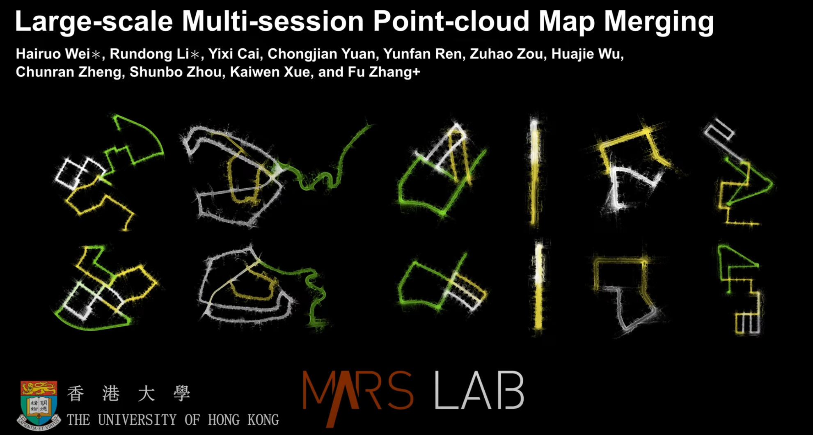

# LAMM: Large-scale Multi-session Point-cloud Map Merging
## **1. Introduction**

Large-scale Multi-session Point-cloud Map Merging(LAMM) is an open-source frame-work for large-scale multi-session 3D LiDAR point cloud map merging. LAMM can automatically integrate sub-maps from multiple agents carrying LiDARs with different scanning patterns, facilitating place feature extraction, data association, and global optimization in various environments. 

### **1.1 Our paper**

Our Paper has been Published in: [IEEE Robotics and Automation Letters](https://ieeexplore-ieee-org.eproxy.lib.hku.hk/xpl/RecentIssue.jsp?punumber=7083369) ( Volume: 10, [Issue: 1](https://ieeexplore-ieee-org.eproxy.lib.hku.hk/xpl/tocresult.jsp?isnumber=10768868&punumber=7083369), January 2025), and is available here: https://ieeexplore.ieee.org/document/10759717

### 1.2 Our Video

Our accompanying video is now available on YouTube:

[](https://www.youtube.com/watch?v=X2WSILJe-Ew)

## 2. Prerequisites

### **2.1 Ubuntu and [ROS](https://www.ros.org/)**
We tested our code on Ubuntu20.04 with ros noetic. Additional ROS package is required:
```
sudo apt-get install ros-xxx-pcl-conversions
```

### **2.2 Eigen**
Following the official [Eigen installation](eigen.tuxfamily.org/index.php?title=Main_Page)

**!! IMPORTANT !!**: As we are using **gtsam 4.0.3**, only **Eigen 3.3.7** works

### **2.3 ceres-solver (version>=2.1)**

Please kindly install ceres-solver by following the guide on [ceres Installation](http://ceres-solver.org/installation.html). Notice that the version of ceres-solver should higher than [ceres-solver 2.1.0](https://github.com/ceres-solver/ceres-solver/releases/tag/2.1.0)

### **2.4 GTSAM**
Following the official [GTSAM installation](https://gtsam.org/get_started/), or directly install GTSAM 4.x stable release by:
```
# Add PPA
sudo add-apt-repository ppa:borglab/gtsam-release-4.0
sudo apt update  # not necessary since Bionic
# Install:
sudo apt install libgtsam-dev libgtsam-unstable-dev
sudo apt-get install libgsl-dev                    
```
**!! IMPORTANT !!**: Please do not install the GTSAM of ***develop branch***, which are not compatible with our code! We are still figuring out this issue.

### 2.5 **livox_ros_driver**

Follow [livox_ros_driver Installation](https://github.com/Livox-SDK/livox_ros_driver).

*Remarks:*

- Since the LAMM support Livox serials LiDAR, the **livox_ros_driver** must be installed and **sourced** before run our launch file.
- How to source? The easiest way is add the line `source $Livox_ros_driver_dir$/devel/setup.bash` to the end of file `~/.bashrc`, where `$Livox_ros_driver_dir$` is the directory of the livox ros driver workspace (should be the `ws_livox` directory if you completely followed the livox official document).

### 2.6 TBB

Install gcc-9 g++-9

```
sudo add-apt-repository ppa:ubuntu-toolchain-r/test
sudo apt update
sudo apt install gcc-9 g++-9
cd /usr/bin
sudo rm gcc g++
sudo ln -s gcc-9  gcc
sudo ln -s g++-9 g++
```

Follow [[TBB Installation](https://solarianprogrammer.com/2019/05/09/cpp-17-stl-parallel-algorithms-gcc-intel-tbb-linux-macos/)] (**Note:** change the gcc-9.1/g++-9.1 to gcc-9/g++-9)

## 3. Build and Run

Clone the repository and catkin_make:

```
cd ~/catkin_ws/src
git clone git@github.com:hku-mars/LAMM.git
catkin_make
echo 'export LD_LIBRARY_PATH=$LD_LIBRARY_PATH:/usr/local/lib:/usr/lib' >> ~/.bashrc
source ~/.bashrc
# if you are using zsh
# echo 'export LD_LIBRARY_PATH=$LD_LIBRARY_PATH:/usr/local/lib:/usr/lib' >> ~/.zshrc
# source ~/.zshrc
```

`source devel/setup.bash` (**Note:** change the path for TBB in CMakeList.txt)

We provide a test data to demonstrate the file structure, which is available here: https://connecthkuhk-my.sharepoint.com/:u:/g/personal/hairuo_connect_hku_hk/EdWNkRVCcxVGmSRSk0vC8PMBBoeC9NpXaErjytJ1cQMXTQ?e=vAWa6R

The test data is composed of 2 part: The first part includes three sequences from KITTI00, which are steady point clouds without moving objects and can be used to test the map merging task; The seconde part includes a sequence in HeLiPR dataset,  which can be used to test the moving objects removal task.

To test your own data, you should prepare the file as follows, and remember to change relative path in launch file.

```
Data Structure for Map Merging
.
└── test_data
    ├── 0(point cloud file)
    │   ├──1.pcd(a scan)
    │   ├──2.pcd
    │   └── ...
    ├── 0.txt(pose of each scan: timestamp x y z x y z w)
    ├── 1
    │   ├──1.pcd
    │   ├──2.pcd
    │   └── ...
    ├── 1.txt
    ├── pose_correct
    └── truth
        ├──0.txt
        └──1.txt
Data Structure for Moving Objects Removal
.
└── test_data
    ├── pcd(point cloud file)
    │   ├──1.pcd
    │   ├──2.pcd
    │   └── ...
    ├── pose.txt(pose file)
    ├── once_saved
    └── twice_saved(where the steady point clouds are saved)
```

To run map merging example, you should change the path of `root_dir` in `rgb_multi_mapping.launch`, and run:

```
roslaunch btc_loop rgb_multi_mapping.launch
```

To see the merging results, you can change the path of `root_dir` and `load_dir` in `load_cloud.launch`, and run:

```
roslaunch btc_loop load_cloud.launch  
```

To make merging tasks more efficient, we make removal of moving objects an independent task. You can prepare your own data, change `load_dir`, `dyn_obj/save_file`, `dir_back` and `steady_save` in `load_cloud_rgb.launch`, and run: `roslaunch m_detector load_cloud_rgb.launch`

The result of steady point clouds of each scan and whole point clouds will be save in the twice_saved file. 
